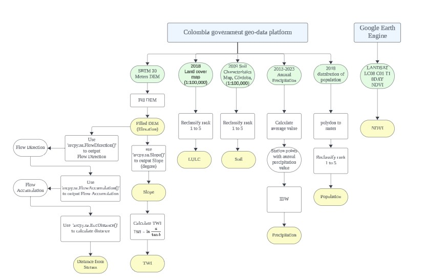
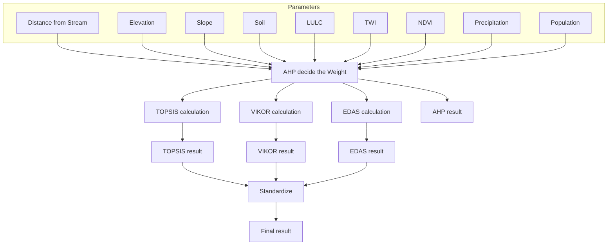

# Montería, Colombia Flood Assessment

This project focuses on assessing flood risks in Montería, Colombia, with a specific interest in investigating infection transmission during floods. Given the challenges with historical flood data quality, a Multi-Criteria Decision Making (MCDM) approach was employed.

## Data Sources
- **[GOV.CO](https://www.colombiaenmapas.gov.co/):** 
  GOV.CO includes comprehensive geo data in Colombia and is managed by the Colombian government.

- **[IDEAM](http://dhime.ideam.gov.co/atencionciudadano/):** 
  IDEAM stands for the Institute of Hydrology, Meteorology, and Environmental Studies (Instituto de Hidrología, Meteorología y Estudios Ambientales). It provides hydrology, meteorology, and environmental data.

## Data Flow Diagram

The following diagram illustrates the parameters preparation:

The following diagram illustrates the MCDA process:

## Methodology
A combination of various MCDM methods was used to ensure a comprehensive evaluation of high-risk areas:

1. **AHP (Analytic Hierarchy Process):**
   - Used to determine the relative importance (weights) of each criterion.
   
2. **TOPSIS (Technique for Order Preference by Similarity to Ideal Solution):**
   - Evaluates alternatives based on their distance to an ideal solution, considering both best and worst-case scenarios.

3. **VIKOR (VlseKriterijumska Optimizacija I Kompromisno Resenje):**
   - Ranks alternatives with conflicting criteria by finding the closest solution to the ideal, ensuring a balanced compromise.

4. **EDAS (Evaluation Based on Distance from Average Solution):**
   - Assesses alternatives by calculating their positive and negative distances from an average solution.

### Process Overview:
- AHP was first used to determine the criterion weights.
- These weights were applied in the TOPSIS, VIKOR, and EDAS methods to generate flood risk maps.
- The results from these methods were standardized to produce a final flood risk assessment map.

## Tools & Environment
- **Software:** All analyses were conducted using ArcGIS Pro 3.1.0.

## References
- Mitra, Rajib & Das, Jayanta. (2022). A comparative assessment of flood susceptibility modelling of GIS-based TOPSIS, VIKOR and EDAS techniques in the Sub-Himalayan foothills region of Eastern India. 10.21203/rs.3.rs-1710264/v1.
